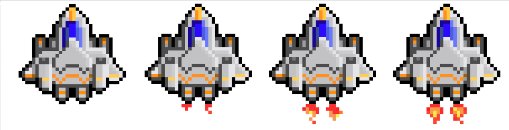
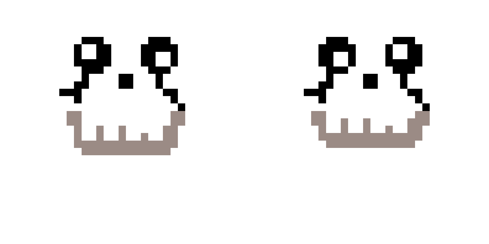

 

    
<strong>Họ và tên:</strong> Doãn Duy Lợi

    
<strong>Mã số sinh viên:</strong> 24021549

    
<strong>Lớp:</strong> K69I-CS1

  

  <h1>🎮 Game: Space Shooter 🚀</h1>

  

    <h2> Giới thiệu</h2>
    
<strong>Space Shooter</strong> là trò chơi bắn phi thuyền cổ điển phong cách pixel. Bạn sẽ điều khiển một phi thuyền không gian, chiến đấu với làn sóng quái vật ngoài hành tinh đang tấn công Trái Đất.

  

  

    <h2>🕹️ Nội dung và cách chơi game</h2>
    
Nội dung: Trò chơi bắt đầu khi phi thuyền của bạn tiến vào vùng không gian. Nhiệm vụ của bạn là tiêu diệt toàn bộ các quái vật xuất hiện và nhận được những phần quà để đạt điểm cao nhất. Bạn sẽ thua khi bị quái vật chạm phải hoặc vượt qua bạn. Mỗi lần bắn trúng quái vật bạn sẽ được 1 point ( mỗi khi bạn thêm được 10 point thì speed của quái vật sẽ tăng lên một con số nhất định), bắn trúng gift bạn sẽ được +1 speed. Hãy sống sót càng lâu càng tốt!

    
Cách chơi: Phi thuyền được điều khiển từ các nút trong bàn phím:

    
- w: đi lên

    
- s: đi xuống

    
- a: sang phải

    
- d: sang trái

    
- shift: dừng

    
- space: bắn

    
- esc: tạm dừng trò chơi

    
- ctrl + các nút di chuyển: tăng tốc

   
  

  <h2>Hình ảnh có trong game</h2>
  
spaceship ( tham khảo từ https://perchance.org/ai-text-to-image-generator và vẽ thêm)

   
   
  
   
skulls (enemy) (tự vẽ)

   
   
gift (tham khảo trên mạng)

   
   
background (tham khảo trên mạng)

   
  

  <h2>Nguồn sound, file sdl </h2>
  
- Sound:

  
click.mp3, pop.mp3, reward.mp3, end.mp3: https://tiengdong.com/ 

  
file sdl: từ github của bài giảng trên lớp

  
code: vận dụng kiến thức bản thân và tham khảo code từ AI

 

   <h2>Code</h2>
  
Gồm 1 file main và 19 file headers

  

  <h2>Thuật toán xử lí va chạm</h2>
  
Chia ship thành 4 phần theo chiều ngang, mỗi phần có chiều rộng khác nhau do cấu trúc của phi thuyền. "skull.png" và "gift.png" được tính là va chạm với "spaceship.png" khi tọa độ của các khối đó nằm trong 1 trong 1 phần của phi thuyền. 

</body>
</html>
